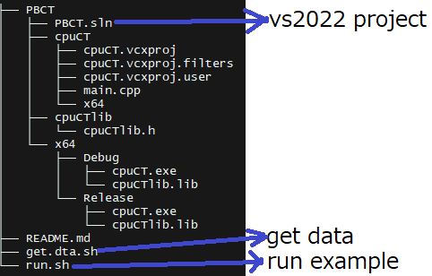

# This project focuses on parallel-beam CT image reconstruction using the Filtered Back Projection (FBP) algorithm.

## 1, How to open Project:  the project is created with Visual Studio 2022

    PBCT.sln is the VS2022 solution 

## 2, How to get Data: 

    e.g. bash get.dta.sh

    or   
		mkdir data && cd data
		wget http://www-bl20.spring8.or.jp/xct/soft/lzh/offsetCT.zip
		unzip offsetCT.zip
		wget http://www-bl20.spring8.or.jp/xct/soft/lzh/ct_test_raw.zip
		unzip ct_test_raw.zip

## 3, How to run example

     e.g.    bash run.sh CPU offsetCT
     
             bash run.sh CPU normalCT
			 

			 
			 
			 
## Note:  

	The bash command can be run on Windows with Cygwin Terminal (https://www.cygwin.com/)
 
	The current version is for CPU runs, the GPU version will be updated!
